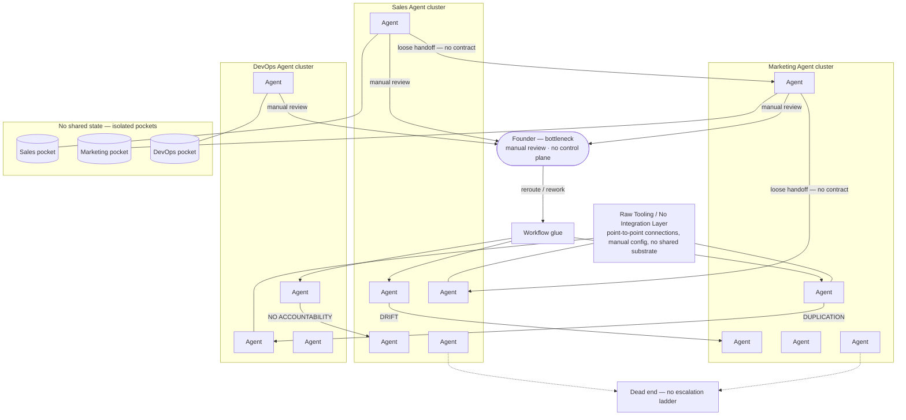

# Diagram — Current State (Kloudedge Blob Model)

Flat domain clusters plus workflow glue: roughly **11–14 agents** in motion without a control plane—strong execution at the edges, weak structure in the middle. The founder stays load-bearing through **manual review**; context stays siloed and handoffs stay informal—coordination debt scales faster than headcount.

**Read:** Cross-cluster links carry **DRIFT**, **DUPLICATION**, and **NO ACCOUNTABILITY** because nothing authoritative owns phase boundaries or proof-of-done. **Manual review** concentrates on the **founder** (bottleneck). **No shared state** keeps pockets from compounding into one audit-ready record. **Raw tooling** ties clusters together without an integration layer—point-to-point glue only. Sideways “escalation” hits **dead ends**—there is no upward ladder with teeth.
