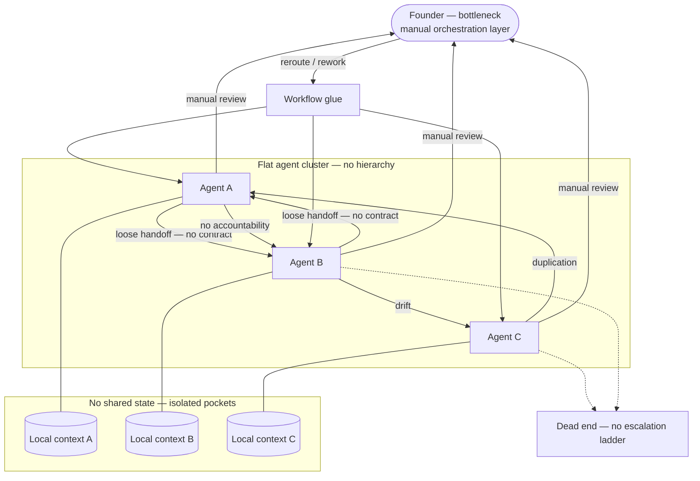

# Diagram — Current State (Kloudedge Blob Model)

Flat agent cluster with workflow glue: strong execution at the edges, weak structure in the middle. The founder stays load-bearing as the informal orchestration layer; context stays siloed and handoffs stay loose—coordination debt scales faster than headcount.

**Read:** Inter-agent links carry **drift**, **duplication**, and **no accountability** because nothing authoritative defines phase ownership or proof of done. **Manual review** concentrates on the founder (bottleneck). **No shared state** keeps pockets from compounding into one audit-ready record. Sideways “escalation” hits **dead ends**—there is no upward ladder with teeth.
