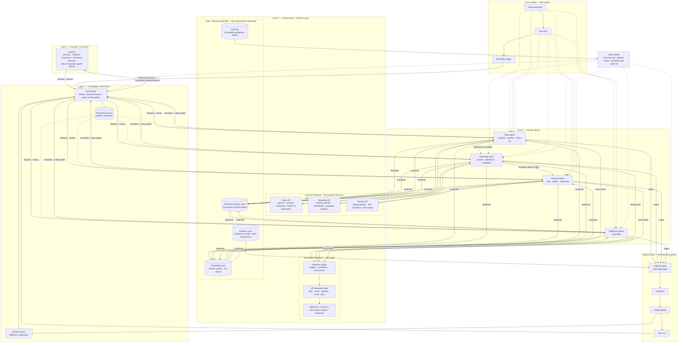

# Diagram — Target State (Kloudedge Control Plane)

Governed stack: **Founder → Kloudedge Control Plane (Orchestrator) → domain agents → Infrastructure + Systems Layer**, with **inter-agent contracts**, cross-cutting **self-healing**, **adaptive loop**, **versioned configs**, **persistent memory**, **observability**, and the **engine / product / data substrates** that turn workflows into something buyers can deploy.

**Business labels on key nodes**

| Node | Label |
|------|--------|
| Evidence gate | **client deliverable** |
| Execution log (inside Observability) | **audit trail** |
| Version control | **rollback on regression** |
| Persistent memory | **platform stickiness** |
| Adaptive loop | **self-improving system** |
| Automation Substrate | **the engine** |
| Systems Powered | **the product clients buy** / **what the agents power** |
| Data + Memory Substrate | **the compounding advantage** |
