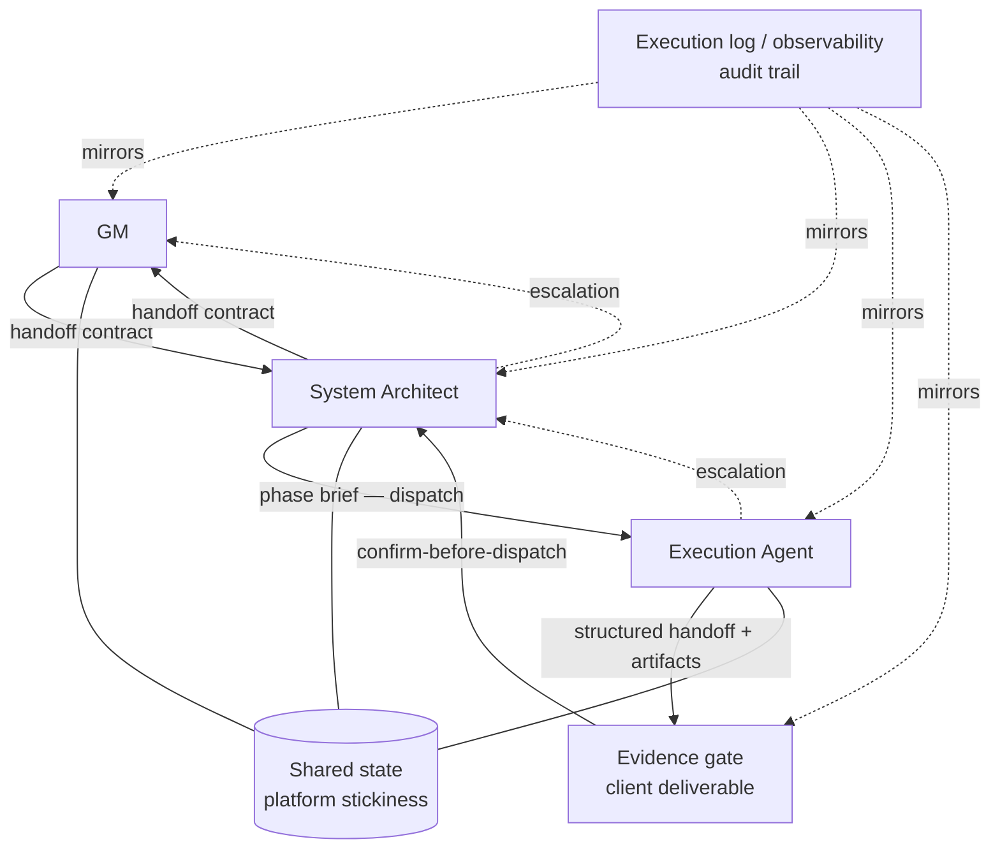

# Diagram — Target State (ACS Control Plane)

Governance layer on top of execution: hierarchy, handoff contracts, **confirm-before-dispatch** through an **evidence gate**, **escalation** that runs **upward only**, **shared state** all layers read/write, and an **execution log** that mirrors runs for audit.

**Business labels**

| Element | Meaning |
|--------|---------|
| Evidence gate | **Client deliverable** — verifiable outputs buyers can defend internally (what shipped, validated, escalated, locked). |
| Execution log | **Audit trail** — what ran, what passed gates, what escalated; substrate for enterprise trust. |
| Shared state | **Platform stickiness** — durable context and obligations compound instead of evaporating between phases. |
